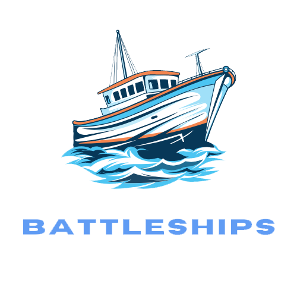
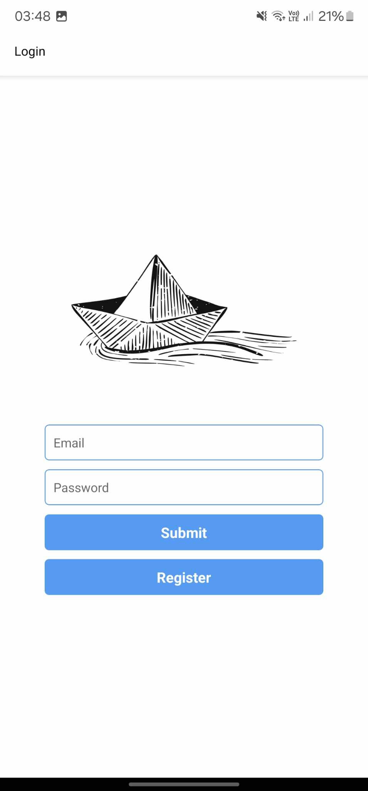
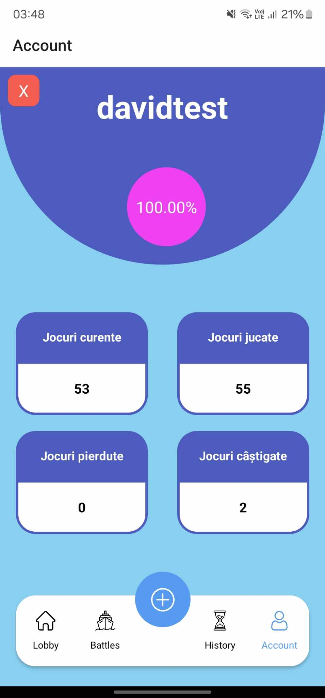
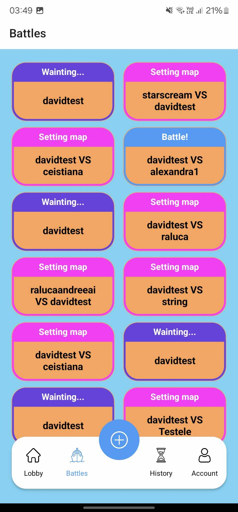
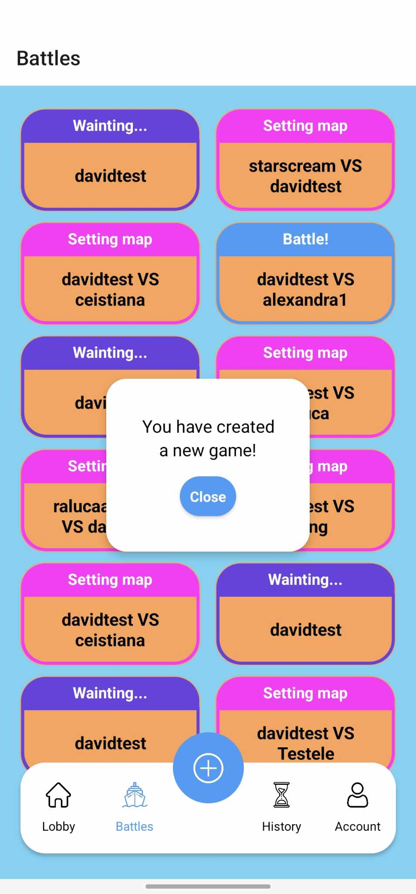
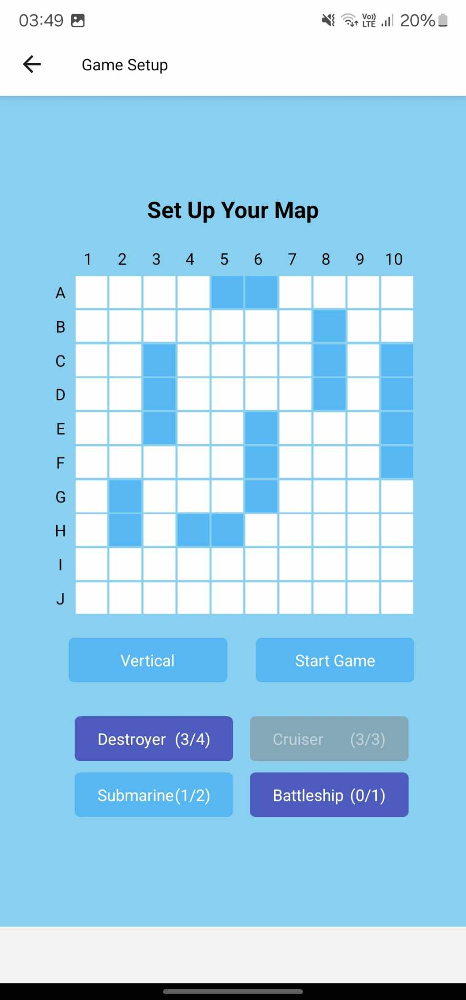
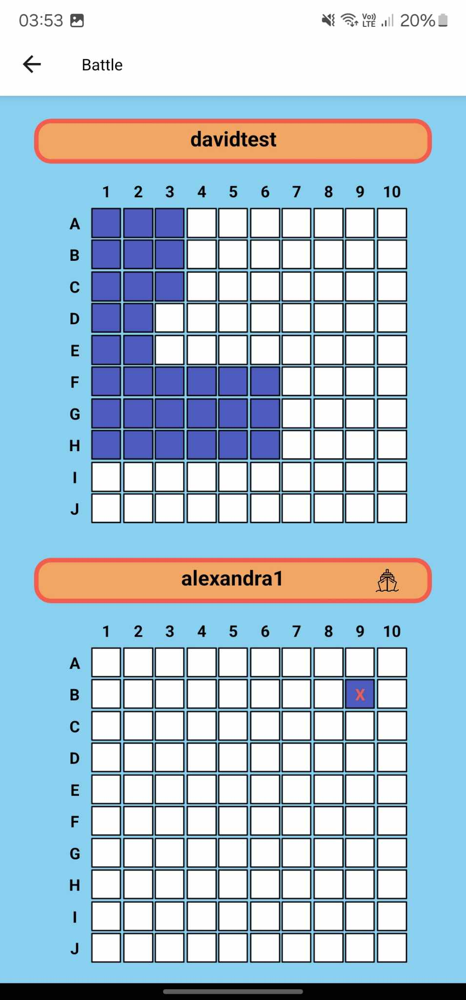
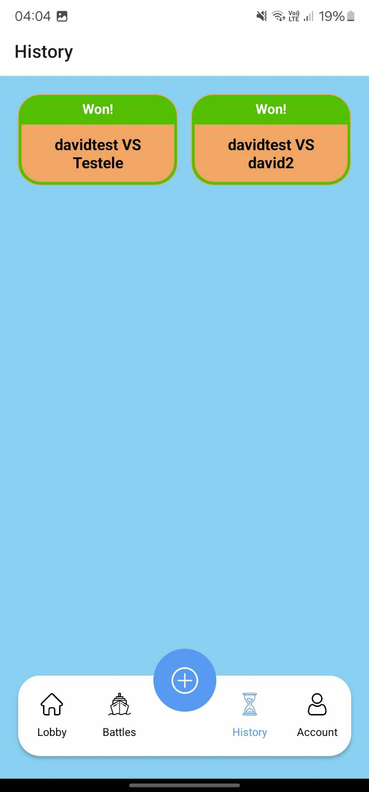
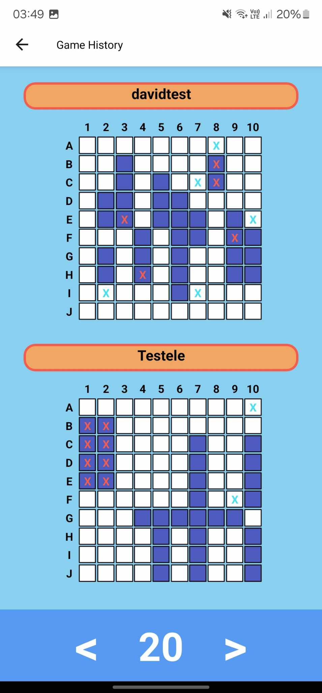

<h1 align="center">
  
</h1>
<h2 style = "text-indent: 50px;"> 
Battleships is a 2-player online multiplayer mobile game, perfect for friends and families. 

</h2>

<h2 align = "center"> 
     
Made by:

     
🦆 <a href= "https://github.com/DavidPatranjel" >David Patranjel</a> and  🐈 <a href = "https://github.com/alexandraghinea">Alexandra Ghinea</a>

</h2>
 

## 📂 Tech Stack

<code> 	  </code>

## ⏳ Backlog
For backloging we used GitHub Issues and Projects. The full backlog can be found <a href= "https://github.com/users/DavidPatranjel/projects/1">here</a>.

## 🎮 Demo images of features

Login and register pages   |  User  data and logout   
:-------------------------:|:---------------------------:
   |  

Interactive menu and lobby  |  Pop up design when creating new game   
:-------------------------:|:---------------------------:
   |  

Table set up for each player   |  Real time battle with interactive map   
:-------------------------:|:---------------------------:
   |  

Finished game status in-game and in lobby  |  Step-by-step game history    
:-------------------------:|:---------------------------:
   |  
